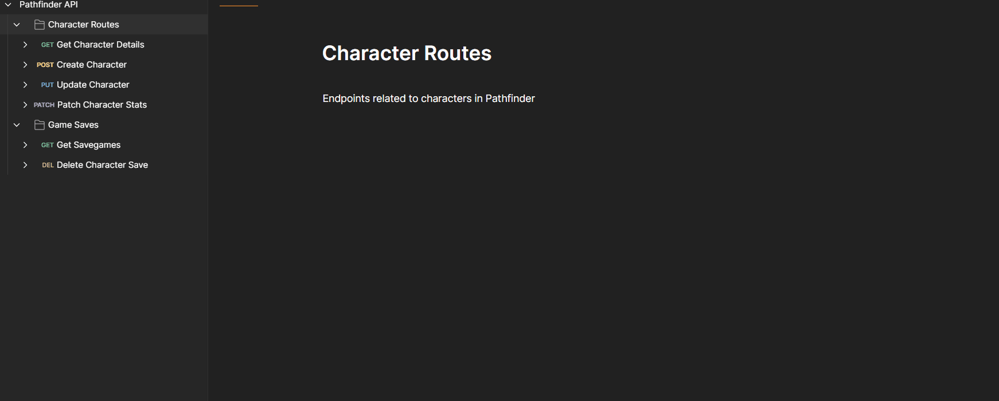

# API Documentation Generator

A powerful tool that automatically generates beautiful HTML documentation from Postman collections and route files.

## Features

- Converts Postman collections into interactive HTML documentation
- Extracts route parameters and validation rules from Express.js route files
- Responsive sidebar navigation
- Color-coded HTTP methods
- Collapsible sections for each API endpoint
- Syntax-highlighted request/response examples
- Status code indicators with color coding
- Markdown link support
- Scrollable response tabs

## Prerequisites

- Python 3.x
```
pip install
```
- Jinja2
```
pip install jinja2
```
- Postman collection export (JSON format)

- route files (optional)

## Usage


1. Export your Postman collection as JSON and save it as `json files/input.json` (!! IMPORTANT: Make sure the collection name is the same as the folder name in the directory!!)
2. (Optional) Place your route files in the `routes` directory (create one if there's none)
3. Run the Jupyter notebook `documentator.ipynb`
4. Access the generated documentation at `index.html`

## Customization

- Modify `styles/styles.css` to customize the appearance
- Edit `templates/template.html` to change the documentation structure
- Adjust the Python code in `documentator.ipynb` to modify the generation logic

## Features Breakdown

### Route Parameter Extraction
- Automatically detects `check()` validations from Express.js routes
- Maps parameters to corresponding API endpoints
- Postmen does not save the data type of the parameters, so we need to manually add them. However since most API routes are using `check()` to validate the data type, we can just use the `check()` function to extract the datatypes and determine if its a string, number, or boolean. Of course, the Backend programmer needs to add the `check()` function to the route. for this feature to be working.

### Documentation Elements
- Sidebar navigation with collapsible sections
- Request details including method, URL, and parameters
- Sample JSON input display
- Response examples with status codes
- Syntax-highlighted code blocks

### Styling
- Bootstrap 4 integration
- Custom CSS for modern look and feel
- Color-coded HTTP methods
- Scrollable response tabs

## License

MIT License

## Contributing

Feel free to submit issues, fork the repository, and create pull requests for any improvements.
